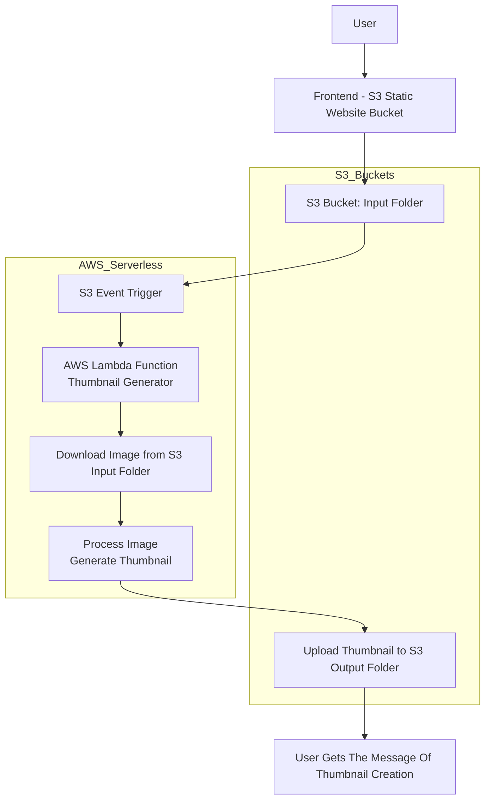

# AWS-Serverless-Thumbnail-Generator

## Overview
A fully serverless image processing system that automatically generates thumbnails when users upload images to Amazon S3. The system uses AWS Lambda triggered by S3 events and stores processed thumbnails in a separate output folder.  

## Tech Stack
- Frontend: HTML, CSS, JavaScript
- Backend: AWS Lambda (Python, Boto3)
- Storage: Amazon S3 (Input & Output buckets)
- Event Trigger: S3 Event Notifications

## Architecture

## AWS Services Used
- Amazon S3
- AWS Lambda
- IAM Roles
- CloudFront for frontend hosting

## Features
- Automatic thumbnail generation
- Event-driven processing (S3 → Lambda)
- Separate input and output storage
- Scalable serverless architecture
## Implementation Steps

**Step 1:**  
Created two S3 buckets – one for hosting the frontend (static website) and another for storing uploaded images and generated thumbnails.

**Step 2:**  
Configured folder structure inside the S3 bucket:
- `input/` folder to store user-uploaded images  
- `output/` folder to store generated thumbnails  

**Step 3:**  
Developed a simple frontend (HTML, CSS, JavaScript) to allow users to upload images.

**Step 4:**  
Configured AWS Lambda function using Python (Boto3) to process images.

**Step 5:**  
Set up S3 event notification to trigger Lambda automatically when a new image is uploaded to the `input/` folder.

**Step 6:**  
Inside Lambda:
- Download image from S3 `input/` folder  
- Generate thumbnail using image processing logic  
- Upload processed thumbnail to S3 `output/` folder  

**Step 7:**  
Tested the workflow by uploading images from the frontend and verifying automatic thumbnail generation.

**Step 8:**  
Validated output by checking the `output/` folder for generated thumbnails.

## Repository Structure
```text
lambda/ - AWS Lambda function code
frontend/ - HTML UI for uploading images
screenshots/ - Project UI and output images
architecture/ - System architecture diagram
