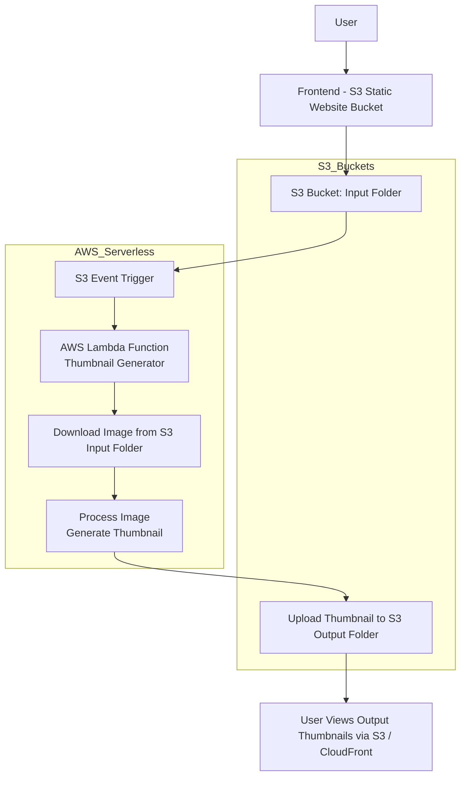

# AWS-Serverless-Thumbnail-Generator

## Overview
A fully serverless image processing system that automatically generates thumbnails when users upload images to Amazon S3. The system uses AWS Lambda triggered by S3 events and stores processed thumbnails in a separate output folder.

## Architecture

## AWS Services Used
- Amazon S3
- AWS Lambda
- IAM Roles
- (Optional) CloudFront for frontend hosting

## Features
- Automatic thumbnail generation
- Event-driven processing (S3 → Lambda)
- Separate input and output storage
- Scalable serverless architecture

## Repository Structure
```text
lambda/ - AWS Lambda function code
frontend/ - HTML UI for uploading images
screenshots/ - Project UI and output images
architecture/ - System architecture diagram
