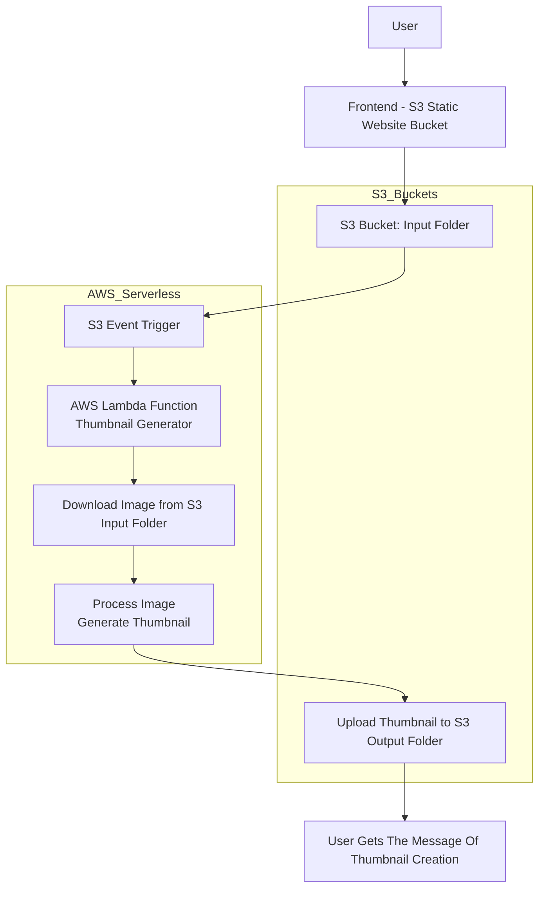

# AWS-Serverless-Thumbnail-Generator

## Overview
A fully serverless image processing system that automatically generates thumbnails when users upload images to Amazon S3. The system uses AWS Lambda triggered by S3 events and stores processed thumbnails in a separate output folder.  

## Tech Stack
- Frontend: HTML, CSS, JavaScript
- Backend: AWS Lambda (Python, Boto3)
- Storage: Amazon S3 (Input & Output buckets)
- Event Trigger: S3 Event Notifications

## Architecture

## AWS Services Used
- Amazon S3
- AWS Lambda
- IAM Roles
- CloudFront for frontend hosting

## Features
- Automatic thumbnail generation
- Event-driven processing (S3 → Lambda)
- Separate input and output storage
- Scalable serverless architecture
## Implementation Steps

**Step 1:**  
Created two S3 buckets – one for hosting the frontend (static website) and another for storing uploaded images and generated thumbnails.

**Step 2:**  
Configured folder structure inside the S3 bucket:
- `input/` folder to store user-uploaded images  
- `output/` folder to store generated thumbnails  

**Step 3:**  
Developed a simple frontend (HTML, CSS, JavaScript) to allow users to upload images.

**Step 4:**  
Configured AWS Lambda function using Python (Boto3) to process images.

**Step 5:**  
Set up S3 event notification to trigger Lambda automatically when a new image is uploaded to the `input/` folder.

**Step 6:**  
Inside Lambda:
- Download image from S3 `input/` folder  
- Generate thumbnail using image processing logic  
- Upload processed thumbnail to S3 `output/` folder  

**Step 7:**  
Tested the workflow by uploading images from the frontend and verifying automatic thumbnail generation.

**Step 8:**  
Validated output by checking the `output/` folder for generated thumbnails.  
## Security Best Practices

- Files are uploaded securely using S3-controlled access instead of exposing the bucket publicly.
- AWS IAM roles are used for Lambda with least-privilege permissions (only required S3 access is granted).
- S3 bucket is configured to restrict public access to prevent unauthorized file access.
- Input and output folders are logically separated to isolate raw uploads from processed thumbnails.
- All image processing is handled in AWS Lambda, ensuring no sensitive credentials are exposed in the frontend.
- S3 event notifications are used instead of polling, reducing attack surface and unnecessary API exposure.
- Access to frontend is controlled via S3 static hosting or CloudFront distribution (if enabled).

## Project Outcome

Built a fully serverless, event-driven image processing system using AWS services. The application automatically generates thumbnails when users upload images.  

## Skills Demonstrated

- Amazon S3 (Object Storage & Event Notifications)
- AWS Lambda (Event-driven backend processing using Python)
- IAM Roles & Permissions (Least Privilege Access Control)
- Frontend Development (HTML, CSS, JavaScript)
- Event-driven system design (S3 → Lambda workflow)
- Cloud-based image processing pipeline
- Debugging and integration of AWS services
- Building scalable and cost-efficient cloud applications

## Repository Structure
```text
lambda/ - AWS Lambda function code
frontend/ - HTML UI for uploading images
screenshots/ - Project UI and output images
architecture/ - System architecture diagram  

## Future Improvements

- Add support for multiple image formats (JPEG, PNG, WEBP) with validation
- Enable dynamic thumbnail sizing options (small, medium, large)
- Integrate AWS DynamoDB to store image metadata and processing status
- Add user authentication using AWS Cognito for secure access control
- Implement image compression to reduce storage and improve performance
- Add progress tracking or status updates for uploaded images
- Use CloudFront CDN for faster delivery of thumbnails globally
- Add a frontend dashboard to manage uploaded images and thumbnails
